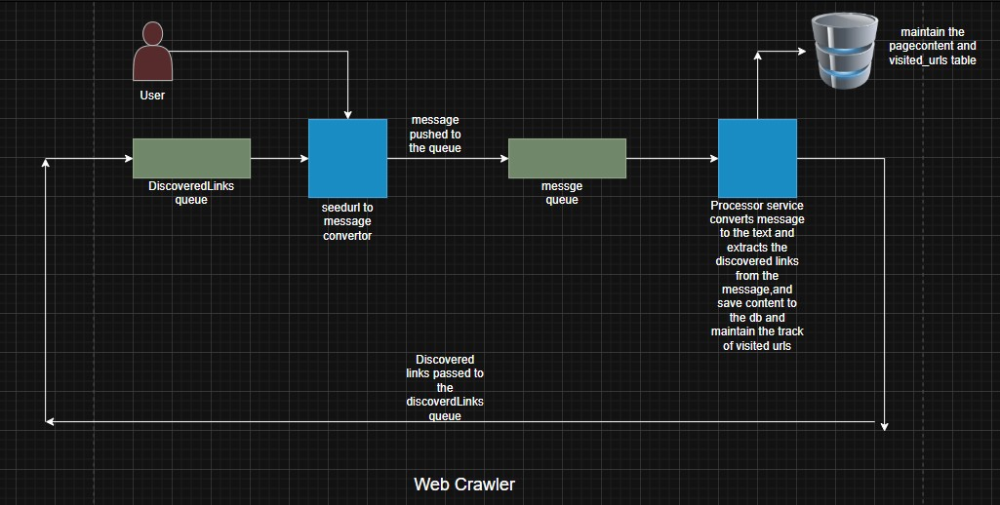

# Cognitron

# Cognitron
🕸️ Web Crawler System DocumentationThis repository contains the architecture and code for a robust, distributed, and automated web crawling system. It is designed to manage the continuous discovery, processing, and storage of web pages using a highly decoupled messaging pipeline.

**Visual Representation of the Crawl Flow:**

---

🧭 System OverviewThe system operates as a continuous loop involving two core services communicating via two dedicated RabbitMQ queues. This design ensures separation of concerns, scalability, and automated link discovery.

🚀 System Architecture & FlowThe system uses two services to manage the flow of data: the Crawler Service (Producer/Consumer) and the Processor Service (Consumer/Producer).

1.The Crawl Cycle.
@@ The system executes the following automated steps:

## Start: The Crawler Service's scheduler triggers, consuming a URL (either a seed or a discovered link) from the discovered-links-queue.
## Produce: The Crawler Service transforms the URL into a detailed message and pushes it to the content-crawl-queue.
## Consume & Process: The Processor Service consumes the message from the content-crawl-queue. It downloads the page, extracts content, and checks the URL against the database's visited_urls table.
## Data Persistence: If the URL is new, the Processor Service saves the crawled page content and marks the URL as visited in the database.
## Re-Queue Discovered Links: The Processor Service extracts all new links from the page and pushes them back to the discovered-links-queue.
## Loop: The Crawler Service immediately pulls these newly discovered links, restarting the cycle.

⚙️ Service Roles and QueuesThe use of two queues is key to managing the flow of raw links versus detailed content messages.
## 1. Crawler Service (The Scheduled Producer/Consumer)
Core Function: Manages the schedule, initial seed injection, and consumption of raw links for subsequent processing.
Listens To: discovered-links-queue (Pulls the next URL to crawl).
Pushes To: content-crawl-queue (Sends the structured message for processing).

## 2. Processor Service (The Content Handler)
Core Function: Handles the heavy lifting: HTTP crawling, content extraction, link discovery, and database interaction. It also ensures links are only processed once.
Listens To: content-crawl-queue (Pulls the structured message to begin crawling).
Pushes To: discovered-links-queue (Sends newly found links back to the Crawler Service to perpetuate the cycle).
Messaging QueuesQueue NameProduced ByConsumed ByMessage ContentPurposediscovered-links-queueProcessor ServiceCrawler ServiceRaw URL/StringFeeds the next links into the crawl cycle.content-crawl-queueCrawler ServiceProcessor Servicecom.proc.Model.CrawlMessage (JSON)Holds structured messages awaiting content extraction.

🛠️ Components and Technology Stack
Language: Java
Framework: Spring Boot 3.x
Messaging: RabbitMQ
Database: MySql
